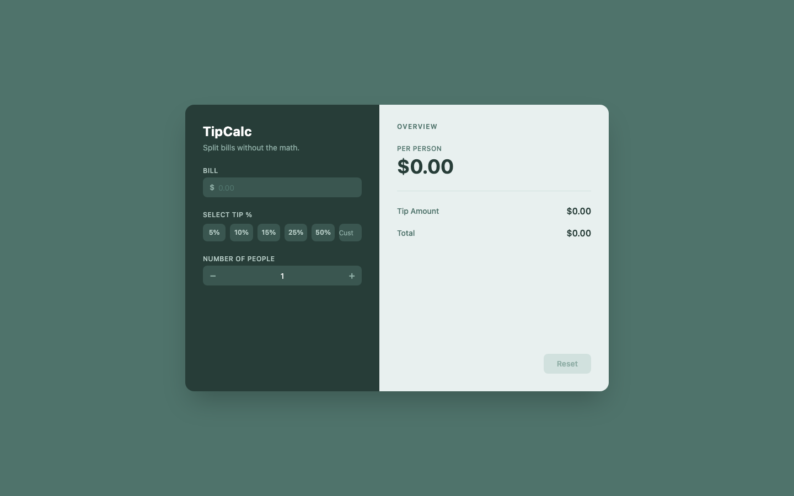

# tipCalc

A tip calculator built with React and TypeScript.

<p align="center">
  
</p>

## Performance

| Metric | Score |
|---|---|
| Lighthouse Performance | 100 |
| Accessibility | 98 |
| SEO | 90 |

## Features

- **Bill Input** — Enter your total bill amount with inline validation.
- **Tip Percentage** — Choose from preset options (5%, 10%, 15%, 25%, 50%) or type a custom value.
- **Number of People** — Specify how many people are splitting the bill.
- **Per-Person Breakdown** — Instantly see tip amount, total, and cost per person.
- **Reset** — Clear all inputs with one click and start fresh.

## Tech Stack

| Concern | Tool |
|---|---|
| Framework | React 18 |
| Language | TypeScript |
| Styling | Tailwind CSS |
| Build | Vite |

## Getting Started

```bash
npm install
npm run dev
```

Open [http://localhost:5173](http://localhost:5173) in your browser.
